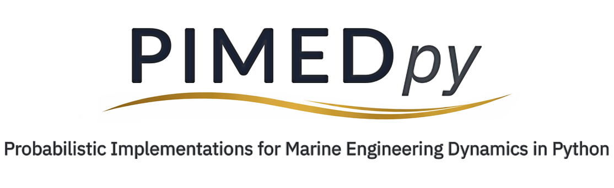

<p align="center">
  
</p>

# PIMEDpy – Probabilistic Implementations for Marine Engineering Dynamics in Python


**A Python toolkit for simulation of marine environment excitations and probabilistic dynamics of ships and other floating structures.**


## About

PIMEDpy is a Python toolkit focused on **probabilistic and statistical analysis of marine engineering system dynamics**. It provides practical tools for:

- Simulating marine environment excitations such as waves, wind, and currents, with emphasis on extreme events.  
- Estimating motions of ships and other floating structures based on practical models.  
- Assessing dynamic behaviour through probability calculation and uncertainty quantification.

The toolkit is intended for research and applied studies. Resulting workflows enable inferences based on minimal input data, with outputs compatible with open-source CFD codes, such as OpenFOAM.


## Features

- Probabilistic modelling of marine environmental loads — including waves, wind, and currents.  
- Time-domain simulation of dynamic responses of marine engineering systems.  
- Statistical post-processing of simulation results for performance assessment.  
- Flexible application to ships and offshore structures.  
- Pure Python implementation — easy to install, extend, and integrate with other workflows.


## Installation

Installation instructions will be provided with the first release, including options for installation from **PyPI** or directly from **GitHub**.


## Quick Example / Usage

```python
import pimedpy

# Example: simulate random wave excitation and ship response 

# 1. Set up environmental conditions
environment = pimedpy.create_environment(
    waves={'spectrum': 'JONSWAP', 'significant_height': 3.0, 'peak_period': 8.0}
)

# 2. Generate a sea-wave realization based on the environment
time, wave_elevation = pimedpy.generate_wave_realization(
    environment['waves'], form='phases', duration=600, variance_error=0.01
)

# 3. Define ship/floating structure data (simplified for example)
ship_data = {
    'displacement': 100.0,   # tonnes
    'length': 20.0,          # meters
    'draft': 6.0,            # meters
    # add other parameters as needed
}

# 4. Run a response simulation (illustrative)
response = pimedpy.simulate_response(environment, ship_data, n_realizations=1000)

# 5. Perform statistical post-processing
summary = pimedpy.analyze_response(response)
print(summary)  # prints ship response statistics
```


## Documentation & Support

Full documentation, examples, and support resources will be provided with the first release.


## Author & Maintainer

Panayiotis A. Anastopoulos, PhD (Naval and Marine Engineering NTUA)  
All development, design, and research for PIMEDpy have been carried out by the author.  
Contributions and collaborations are welcome. Early access and questions are encouraged.  

**Contact:** pa_anasto@yahoo.gr


## License

PIMEDpy will be released under the MIT License. See [LICENSE](./LICENSE) for details.
